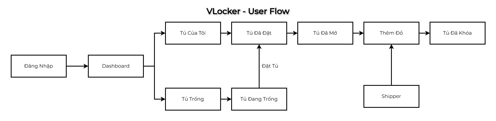
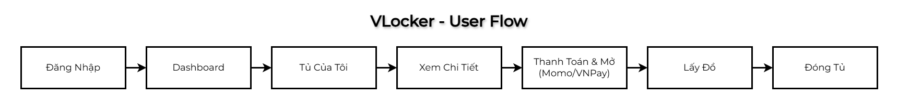
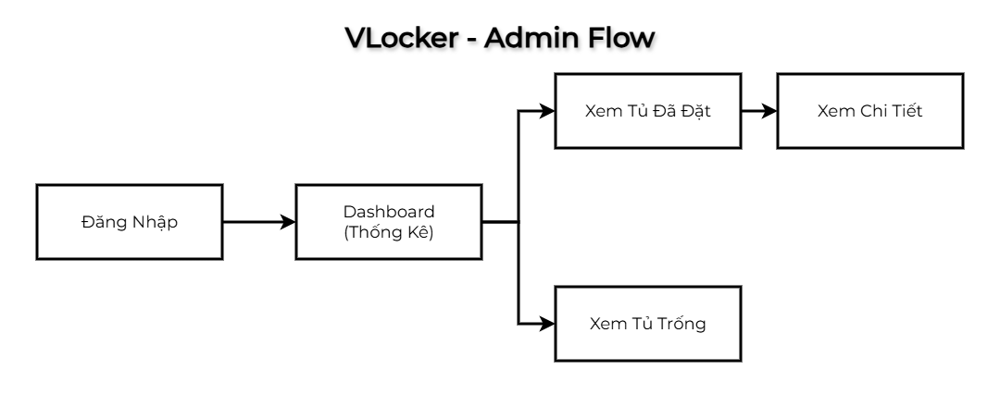

<!-- 
cd vlocker 
npm run dev

git pull

git add .
git commit -m "Update Husky pre-commit hooks"
git push

Password@12345
-->

# VLocker - Ứng Dụng Quản Lý Tủ Khóa Dành Cho Chung Cư

<br>

**Mục tiêu:** Dự án VLocker được xây dựng nhằm **số hóa** và **tối ưu hóa** quy trình quản lý tủ khóa cá nhân, chuyển đổi mô hình quản lý thủ công sang tự động hóa hoàn toàn.

1.  **Tăng cường Bảo mật:** Cung cấp quy trình giao nhận hàng hóa an toàn, đặc biệt cho kịch bản Shipper bỏ đồ, đảm bảo chỉ người thanh toán mới có thể mở tủ.
2.  **Phân quyền Rõ ràng:** Xây dựng hai vai trò Người dùng chính (**Dân cư** và **Quản lý**) với các quyền hạn truy cập và thao tác riêng biệt.
3.  **Tự động hóa Thanh toán:** Xử lý việc tính toán chi phí lưu trữ theo thời gian thực (5k/ngày) và tích hợp cổng thanh toán để kích hoạt mở khóa.

<br>

**Vấn đề mà dự án giải quyết:**
1.  **An ninh & Mất mát Tài sản:** Loại bỏ rủi ro mất mát hoặc nhầm lẫn tài sản khi gửi tạm, do hệ thống khóa cứng tủ sau khi xác nhận bỏ đồ vào.
2.  **Quản lý Thủ công:** Thay thế việc ghi chép sổ sách và theo dõi trạng thái tủ bằng tay, dễ sai sót, bằng một Dashboard trực quan.
3.  **Quy trình Giao nhận Cứng nhắc:** Cho phép người dùng linh hoạt quản lý việc mở/đóng tủ từ xa (hoặc qua ứng dụng) khi vắng nhà, giúp việc giao nhận hàng hóa trở nên dễ dàng và không cần mặt đối mặt.
4.  **Thiếu Lịch sử & Thống kê:** Cung cấp khả năng theo dõi lịch sử thuê tủ, trạng thái sử dụng hiện tại và các báo cáo thống kê quan trọng cho Quản lý.

<br>

**Đối tượng sử dụng:** Dân cư / Quản lý của một Chung Cư

**Demo:** [VLocker - Vercel](vlocker.vercel.app) 

## Giao diện ứng dụng
<p align="center">
<br><i>Chú thích: Giao diện trang chủ, dashboard,... của ứng dụng.</i></p>

## Tính Năng Chính
### Người Dùng:
- Đăng Ký / Đăng Nhập / Quên Mật Khẩu / Đăng Xuất
- Trang chủ
- Trang Dashboard
- Trang profile
- Trang báo cáo
- Trang liên hệ
- Lịch sử tủ

### Dân cư:
- Dashboard (Xem nhanh danh sách tủ của bản thân, danh sách tủ trống)
- Xem tủ cá nhân (Quản lý, khóa, thanh toán)
- Xem tủ trống (Đăng ký)

### Quản lý:
- Dashboard (Thống kê tất cả tủ, xem nhanh danh sách tủ của cả dân cư, danh sách tủ trống)
- Thống kê tủ (Quản lý)
- Xem tủ trống

## User Flow
<p align="center">
<br><i>Chú thích: User Flow - Đặt Tủ & Khóa Tủ (Trường hợp shipper giao hàng)</i></p>

<p align="center">
<br><i>Chú thích: User Flow - Mở Khóa Tủ (Thanh toán tiền thuê mới được mở khóa)</i></p>

## Admin Flow
<p align="center">
<br><i>Chú thích: Admin Flow - Xem Thống Kê & Kiểm Tra Tủ</i></p>

## Use-case Diagram
Dự án có hai tác nhân chính là **Cư dân (Resident)** và **Quản lý (Manager)**.

#### Cư dân (Resident)
- **Quản lý tài khoản:** Đăng ký, Đăng nhập, Đăng xuất, Đổi mật khẩu.
- **Quản lý tủ:**
  - Xem danh sách tủ trống.
  - Đặt một tủ trống.
  - Xem danh sách tủ cá nhân đang thuê.
  - Xem chi tiết và trạng thái của tủ (đã đặt, đang lưu đồ).
  - Thanh toán phí thuê tủ để nhận mã mở khóa.
  - Mở khóa tủ.
- **Tương tác hệ thống:**
  - Xem lịch sử các lần thuê tủ.
  - Gửi báo cáo sự cố/phản ánh.
  - Xem thông báo từ quản lý.
  - Xem và chỉnh sửa thông tin cá nhân.

#### Quản lý (Manager)
- **Quản lý tài khoản:** Đăng nhập, Đăng xuất.
- **Tổng quan hệ thống:**
  - Xem Dashboard với các số liệu thống kê (tổng số tủ, tủ trống, đang dùng...).
  - Xem xu hướng sử dụng theo thời gian.
  - Xem thống kê chi tiết theo từng tòa nhà.
- **Quản lý vận hành:**
  - Xem danh sách tất cả các tủ đang được thuê.
  - Xem chi tiết thông tin người thuê và thời gian sử dụng.
  - Hủy một lượt đặt tủ (trong trường hợp cần thiết).
  - Xem lịch sử tất cả các giao dịch và lọc theo thời gian (tháng, quý, năm).
- **Quản lý báo cáo:**
  - Xem danh sách tất cả các báo cáo từ cư dân.
  - Xem chi tiết mô tả của báo cáo.
  - Cập nhật trạng thái xử lý của báo cáo (chờ xử lý, đang xử lý, đã hoàn tất).
- **Giao tiếp:**
  - Gửi thông báo đến một hoặc nhiều cư dân.
  - Hệ thống hỗ trợ cấu trúc thư cha-con, cho phép quản lý theo dõi thư đã gửi và có khả năng "thu hồi" (unsend) thông báo đã gửi.

## Kiến trúc hệ thống & Công nghệ
Hệ thống được xây dựng theo kiến trúc full-stack với Next.js, tận dụng các công nghệ và công cụ hiện đại để mang lại hiệu quả cao nhất.

1.  **Frontend (Client-side):**
    -   **Framework:** Next.js (React) với App Router.
    -   **Styling:** TailwindCSS và `shadcn/ui` cho các component giao diện.
    -   **State Management & Data Fetching:** Sử dụng các React hook (`useState`, `useEffect`, `useMemo`) kết hợp với `useSWR` để fetching và caching dữ liệu. Áp dụng kỹ thuật "Optimistic UI" trong các tác vụ như xóa hoặc cập nhật thông báo để cải thiện trải nghiệm người dùng, giúp giao diện phản hồi ngay lập tức.

2.  **Backend (Server-side):**
    -   **Framework:** Next.js API Routes. Logic backend được tối ưu hóa hiệu suất bằng cách gộp nhiều tác vụ cập nhật cơ sở dữ liệu và thực thi song song (`Promise.all`), giảm thiểu số lượng lệnh gọi đến database.
    -   **Database ORM/ODM:** Mongoose được sử dụng để định nghĩa schema và tương tác với MongoDB.

3.  **Database:**
    -   **Hệ quản trị CSDL:** MongoDB, một cơ sở dữ liệu NoSQL linh hoạt, phù hợp với việc lưu trữ dữ liệu người dùng, tủ khóa và các giao dịch.

4.  **Authentication:**
    -   **Thư viện:** `next-auth` được sử dụng để xử lý toàn bộ luồng xác thực.
    -   **Chiến lược:** Sử dụng `CredentialsProvider` (email/mật khẩu) và quản lý phiên làm việc bằng JSON Web Tokens (JWT). Thông tin vai trò và ID người dùng được thêm vào token để phân quyền.

5.  **Deployment:**
    -   Ứng dụng được triển khai trên nền tảng Vercel, tối ưu cho các dự án Next.js.

6.  **Công cụ phát triển (Development Tools):**
    -   **Thiết kế (UI/UX):** Figma.
    -   **Quản lý phiên bản:** Git & Github.
    -   **Môi trường phát triển:** Visual Studio Code.
    -   **Code Quality:** Husky được sử dụng để tự động chạy các tập lệnh (như linting, kiểm tra định dạng code) trước mỗi lần commit, đảm bảo chất lượng và tính nhất quán của mã nguồn.

## Database
Cơ sở dữ liệu MongoDB được cấu trúc với các collection chính sau:

-   **`users`**: Lưu trữ thông tin người dùng.
    -   `name`, `email`, `password` (đã được hash), `phone`.
    -   `role` ('resident' hoặc 'manager').
    -   `building`, `block`, `floor`, `unit` (địa chỉ chi tiết).
    -   `resetPasswordToken`, `resetPasswordExpires` (cho chức năng quên mật khẩu).
-   **`lockers`**: Lưu trữ thông tin về từng tủ khóa vật lý.
    -   `lockerId` (mã định danh của tủ).
    -   `building`, `block` (vị trí).
    -   `status` ('available', 'booked', 'maintenance').
    -   `currentBookingId` (tham chiếu đến lượt đặt hiện tại).
-   **`bookings`**: Lưu trữ thông tin về các lượt thuê tủ.
    -   `userId`, `lockerId` (tham chiếu đến người dùng và tủ).
    -   `startTime`, `endTime`.
    -   `status` ('active', 'stored', 'completed', 'cancelled').
    -   `cost`, `paymentStatus`.
    -   `lastReminderAt` (lưu thời điểm gửi thông báo nhắc nhở cuối cùng để tránh spam).
-   **`notifications`**: Lưu trữ các thông báo. Schema được thiết kế với cấu trúc cha-con để quản lý thư gửi và nhận:
    -   `type` ('mailsend', 'mailreceive', 'notice').
    -   `senderId` (ID người gửi, dành cho quản lý).
    -   `recipientId` (ID người nhận).
    -   `parentId` (liên kết thư của người nhận với thư gốc của người gửi).
-   **`reports`**: Lưu trữ các báo cáo sự cố từ người dùng.

## API Documentation
Các API endpoint chính của hệ thống: [VLocker - API Docs](vlocker.vercel.app/swagger) 

## Cài đặt & Khởi chạy
Làm theo các bước sau để cài đặt và chạy dự án trên máy của bạn.

### 1. Yêu cầu
- [Node.js](https://nodejs.org/en) (phiên bản 18.x trở lên)
- [npm](https://www.npmjs.com/) hoặc [yarn](https://yarnpkg.com/)
- [Git](https://git-scm.com/)

### 2. Clone Repository
```bash
git clone https://github.com/HuyVoTran/VLocker.git
cd VLocker
```

### 3. Cài đặt Dependencies
```bash
npm install
```

### 4. Cấu hình biến môi trường
Tạo một file mới tên là `.env.local` ở thư mục gốc của dự án và sao chép nội dung từ file `.env.example`.

```bash
# Dependencies
npm install next@16.0.3 react@19.2.0 react-dom@19.2.0 axios dotenv nodemailer next-auth mongoose bcryptjs lucide-react class-variance-authority clsx tailwind-merge @radix-ui/react-slot @radix-ui/react-alert-dialog @radix-ui/react-dialog @radix-ui/react-dropdown-menu @radix-ui/react-popover @radix-ui/react-tooltip @radix-ui/react-tabs @radix-ui/react-select @radix-ui/react-avatar @radix-ui/react-label @radix-ui/react-separator
```

```bash
# Dev dependencies
npm install -D tailwindcss@^4 @tailwindcss/postcss eslint@^9 eslint-config-next@16.0.3 @types/node@^20 @types/react@^19 @types/react-dom@^19 @types/nodemailer concurrently
```

```bash
npm run dev
```

## Cấu Trúc Thư Mục

## Testing: 
[VLocker - Test Excel](https://vanlangunivn-my.sharepoint.com/:x:/g/personal/huy_2374802010192_vanlanguni_vn/IQBjqpJEX8i4SK68DhYv6WVbAXEe7AWpkchbEqIu7LxWMNM?e=exGJLx)

## Author
- **Trần Võ Huy (Salvio Tran)**
- Email:
  - Công việc: Huy.2374802010192@vanlanguni.vn 
  - Cá nhân: Huyvo0911@gmail.com
- Github: github.com/HuyVoTran

*Đồ án nhằm mục đích học tập, không có ý định tác động đến tổ chức / cá nhân nào.*